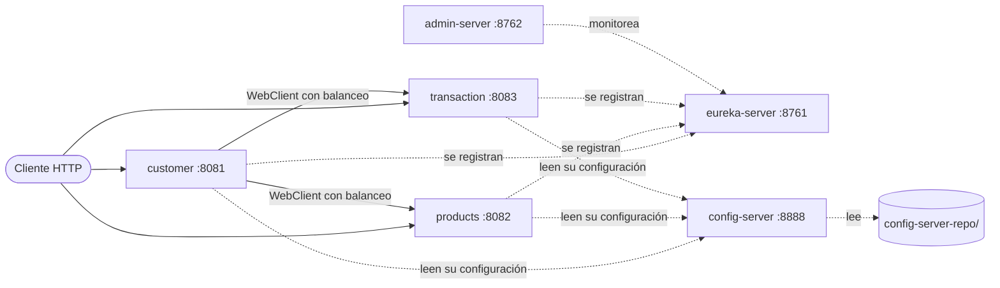

# Microservices Paymentchain

Sistema de pagos de práctica construido con **microservicios en Spring Boot y Spring Cloud**: tres servicios de negocio (clientes, productos y transacciones) y tres de infraestructura (descubrimiento, configuración centralizada y administración).

## Arquitectura



| Módulo | Puerto | Qué hace |
|---|---|---|
| `businessdomain/customer` | 8081 | Clientes. Arma la vista completa de un cliente consultando sus productos y transacciones en los otros servicios. |
| `businessdomain/products` | 8082 | Catálogo de productos. |
| `businessdomain/transaction` | 8083 | Transacciones por cuenta (IBAN) y por referencia. |
| `infraestructuradomain/eureka-server` | 8761 | Registro y descubrimiento de servicios. |
| `infraestructuradomain/config-server` | 8888 | Configuración centralizada; lee [`config-server-repo`](paymentchain-parent/config-server-repo). |
| `infraestructuradomain/admin-server` | 8762 | Spring Boot Admin para ver el estado de los servicios. |

Todo el código está en [`paymentchain-parent`](paymentchain-parent), un proyecto Maven multimódulo.

## Stack

- Java 8, Spring Boot 2.7 y Spring Cloud 2021.0
- Eureka, Spring Cloud Config, Spring Boot Admin
- Spring Data JPA con H2 (desarrollo) o PostgreSQL (producción)
- WebClient con balanceo de carga para la comunicación entre servicios
- Docker y Docker Compose

## Cómo ejecutar

### En local

Requiere Java 8 y Maven. Desde `paymentchain-parent`, arranca los módulos en este orden, cada uno con `mvn spring-boot:run` desde su carpeta:

1. `eureka-server`
2. `config-server`
3. `products`, `transaction` y `customer`
4. `admin-server` (opcional)

Con el perfil `development` los servicios usan H2 en memoria.

### Con Docker Compose

Desde `paymentchain-parent`:

```bash
mvn clean package
docker compose up
```

`mvn package` construye las imágenes `paymentchain/ms-<módulo>` con el plugin `dockerfile-maven`. El compose levanta además PostgreSQL y pgAdmin.

## Endpoints

| Servicio | Ruta base | Operaciones |
|---|---|---|
| customer | `/paymentCustomer/customer` | CRUD, y `GET /full?code=` con los productos y transacciones del cliente |
| products | `/paymentProduct/product` | CRUD |
| transaction | `/paymentTransaction/transaction` | Listar, ver, crear y buscar por cuenta o por referencia |

## Variables de entorno

| Variable | Para qué sirve |
|---|---|
| `EUREKA_SERVER` | URL de Eureka (por defecto `http://localhost:8761/eureka`). |
| `LOCAL_REPOSITORY` | Repositorio git con la configuración. Por defecto, este repo. |
| `CONFIG_SERVER_PASSWORD` | Contraseña del Config Server, tanto en el servidor como en los clientes. Tiene un valor por defecto solo para desarrollo. |

## Tests

```bash
cd paymentchain-parent
mvn test -Ddockerfile.skip=true
```

Los tests no necesitan Eureka ni Config Server levantados.
